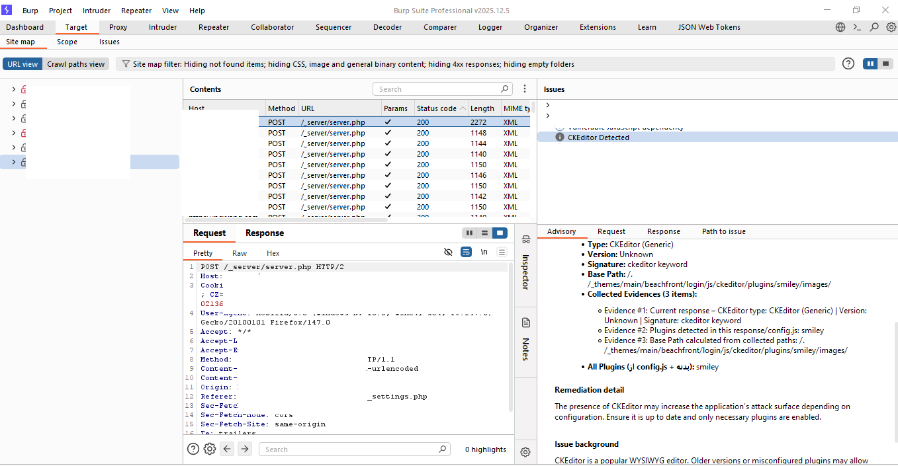

# CKEditor Passive Scanner (Burp Suite Extension)

-blue)

A lightweight **passive scanning** extension for **Burp Suite** that detects, classifies and reports **CKEditor** installations (v4.x and v5.x) along with discovered plugins — all without sending any active payloads.

Built with the modern **Montoya API** — ideal for identifying potentially vulnerable WYSIWYG editors during reconnaissance and manual testing.

---

## 🚀 Key Features

- **Passive Detection** — identifies CKEditor through response bodies (JS, CSS, HTML markers, `CKEDITOR.version`)
- **Version Fingerprinting** — extracts exact version for CKEditor 4 and detects CKEditor 5 editor types (Classic, Inline, Balloon, Decoupled)
- **Plugin Enumeration** — passively discovers loaded plugins (including file uploaders, image processors, etc.)
- **Base Path Calculation** — intelligently determines the most likely installation base path
- **Native Burp Integration** — reports **Information** severity issues directly in the Burp Dashboard / Issue Activity
- **No active traffic** — 100% passive, respects scope & scanner settings

## 📥 Installation

1. Download the latest compiled JAR from the [**Releases**](../../releases) page  
2. In Burp Suite:
   - Go to **Extensions** → **Installed**
   - Click **Add**
   - Choose **Java**
   - Select `CKEditorPassiveScanner.jar`

You should see the message in **Extension** → **Output**:

CKEditor Passive Scanner loaded.

## 🛠 Usage

1. Proxy your target traffic through Burp  
2. Browse the application normally  
3. Look for **Information** issues in **Dashboard** or **Target → Site map** labeled  
   **"CKEditor Detected (CKEditor 4)"** / **"CKEditor Detected (CKEditor 5)"** etc.

Details include:
- Detected type & version
- Signature used
- Calculated base path
- Discovered plugins (if any)

## 🏗 Build from Source

### Recommended: Use the official starter project (easiest & most compatible)

1. In Burp Suite → **Extensions** → **APIs** tab  
2. Click **Download starter project**  
3. Unzip the downloaded archive  
4. Replace the example class with `CKEditorPassiveScanner.java` (keep package name or adjust imports)  
5. Build:

### macOS / Linux
./gradlew build

### Windows
gradlew.bat build

The final JAR will be in build/libs/.
Alternative: Manual compilation with javac (no Gradle/Maven)
Requirements:

Java JDK 17 or higher
Burp Suite Professional / Community JAR (e.g. burpsuite_pro_v2025.12.5.jar)
Matching Montoya API JAR
 

Download the appropriate montoya-api version from Maven Central
Recommended version for Burp 2025.12.5 → 2025.12
 
https://mvnrepository.com/artifact/net.portswigger.burp.extensions/montoya-api/2025.12
 
Click jar and save as montoya-api-2025.12.jar
 ,then Place montoya-api-2025.12.jar in the same folder as your source (or in a libs/ subfolder)
 
### Compile
javac -d build -cp "burpsuite_pro_v2025.12.5.jar;montoya-api-2025.12.jar" CKEditorPassiveScanner.java
 
### Create JAR
jar cvf CKEditorPassiveScanner.jar -C build .
 
 
### macOS / Linux example
 
javac -d build -cp "burpsuite_pro_v2025.12.5.jar:montoya-api-2025.12.jar" CKEditorPassiveScanner.java
 
jar cvf CKEditorPassiveScanner.jar -C build .

## Changelog
1. removing the need for the custom UI tab.
2. Moving the detection logic into a dedicated scan check.

more changelog detail on Changelog.md
 
### 🤝 Contributing

Pull requests are welcome.
 
For major changes, please open an issue first to discuss what you would like to change.

## 🗺️ Roadmap & Future Works

Support for additional WYSIWYG editors (TinyMCE, Froala, Summernote, Quill, etc.) 
Automatic discovery of known sensitive endpoints (upload handlers, connectors, config files)
 
Version-to-CVE mapping and advisory links
📄 License
MIT
